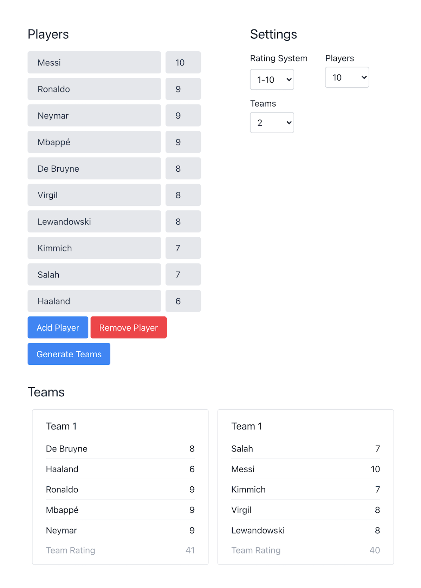

# Rating-based team generator

A web application that allows users to generate fair teams based on player ratings.

Built with React.

## Usage

Clone the repo and install the dependencies

```
git clone https://github.com/hamzac/rating-based-team-generator.git
cd rating-based-team-generator
npm install
```

Run the app locally

```
npm run start
```

Go to [http://localhost:3000](http://localhost:3000).

## Example



## How it works

The task of finding (reasonably) fair and balanced teams given a set of players and a measure of their strength can be described as a special case of the [Partition Problem](https://en.wikipedia.org/wiki/Partition_problem). This is the problem of determining "whether a given multiset S of positive integers can be partitioned into two subsets S1 and S2 such that the sum of the numbers in S1 equals the sum of the numbers in S2".

In this case, ideally, we want to find a set of partitions where the difference in sum of each partition is minimised. Equally sized teams (or almost, if there is an odd number of players) will be a constraint. We also want to be able to determine k partitions for k teams, not just 2. Another important feature is the ability to get different but fair teams every time teams are generated. We could determine all possible partitions, but this would be computationally expensive. Instead, the algorithm non-determistically arrives at a different single approximate solution each time.

### Algorithm

1. Generate an initial set of completely random teams.
2. Calculate the sum of player ratings for each team.
3. If the difference between the highest and lowest rated teams is 0, balanced teams have been found.
4. Otherwise, randomly select a player from the highest and lowest rated teams and swap them.
5. Repeat steps 2-3 while tracking the current best set of teams until teams with a rating difference of 0 have been found or a fixed number of iterations has occured.
